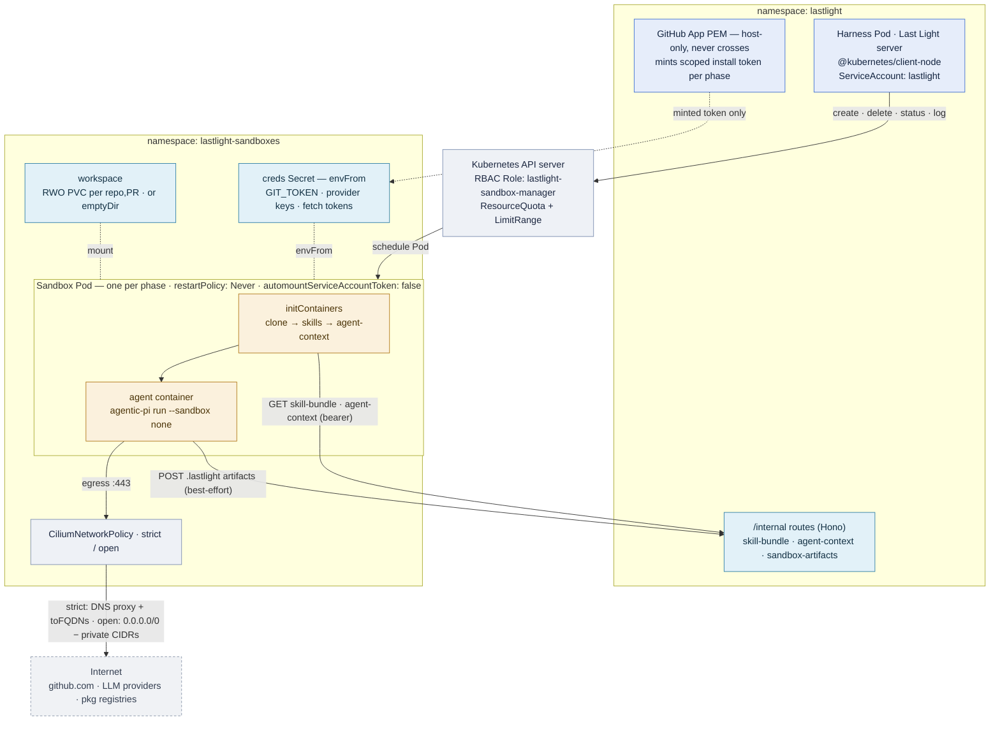
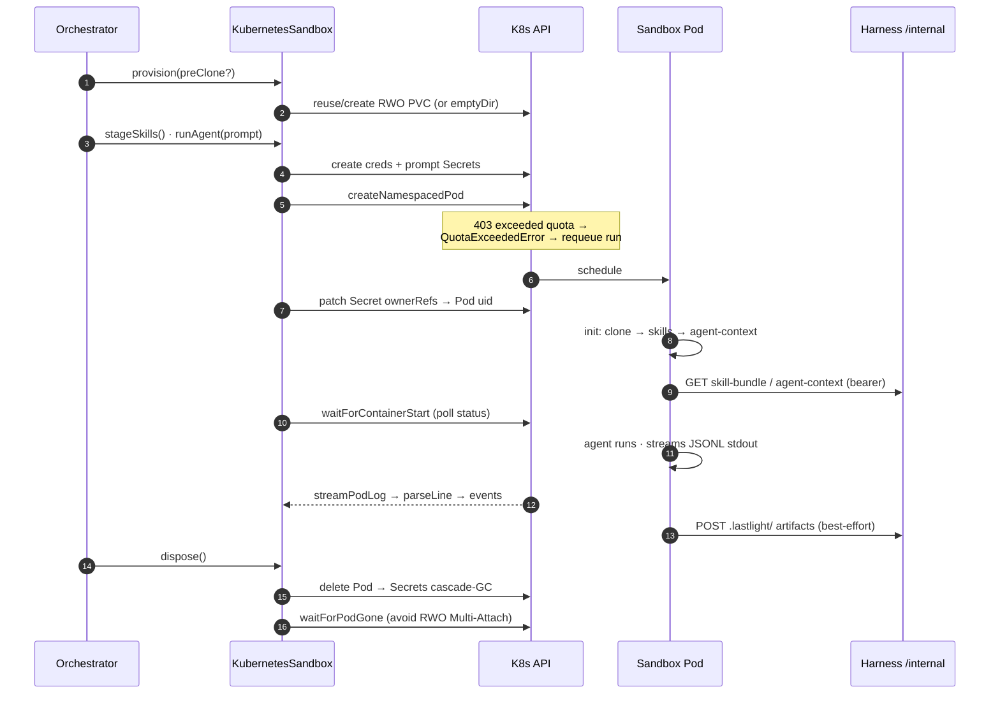
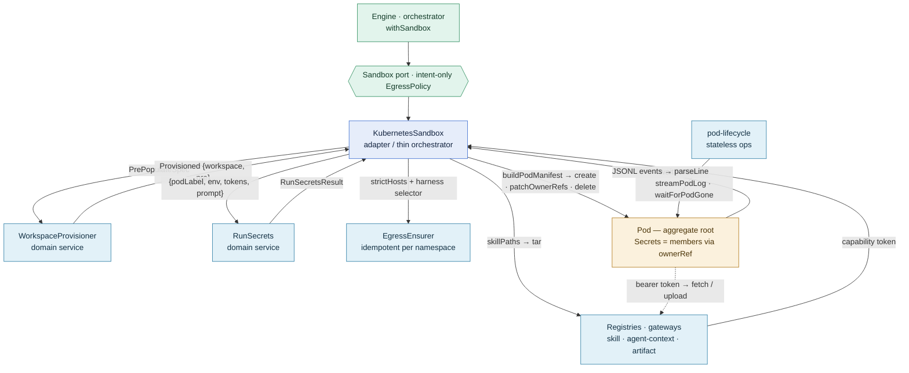

# Kubernetes sandbox backend — architecture

Diagrams for the `kubernetes` sandbox backend (`LASTLIGHT_SANDBOX=kubernetes`).
Every workflow phase runs as its own bare, hardened Pod in a dedicated
namespace; the harness is a Kubernetes API client that mints per-run
credentials, streams the agent's output back, and reaps the Pod when the phase
ends. Full prose contract: [`spec/09-sandbox.md`](../../spec/09-sandbox.md);
cluster prerequisites and manifests: [`README.md`](./README.md).

Adapter: `src/sandbox/k8s/kubernetes-sandbox.ts`.

## 1 · Structure — two namespaces, one API server between them

The harness lives in `lastlight` and holds every secret. It never shares a
filesystem with the agent, so three things ride HTTP `/internal/*` routes
instead. Sandboxes live in `lastlight-sandboxes`, one ephemeral Pod per phase,
each wrapped by a `CiliumNetworkPolicy`. The harness reaches the cluster with a
least-privilege `Role` bound to its `ServiceAccount` by a cross-namespace
`RoleBinding`.

## 2 · Time — one phase, one Pod, provision to reap

`KubernetesSandbox` is a thin orchestrator over collaborators
(`WorkspaceProvisioner`, `RunSecrets`, `EgressEnsurer`, the free functions in
`pod-lifecycle.ts`). Secrets are created *before* the Pod — a Pod naming a
missing Secret never starts — then adopted by the Pod's `ownerReferences` so
deleting the Pod cascade-GCs them.

## 3 · Domain model — information flow between the objects

A classic *ports & adapters* slice. The engine speaks one ubiquitous language —
the `Sandbox` port and an intent-only `EgressPolicy` — and `KubernetesSandbox`
is the adapter that translates that intent into cluster objects. It owns almost
no logic itself; it routes messages between collaborators, each carrying a typed
value object rather than a loose bag of strings.

| Object | Stereotype | Carries / produces |
|---|---|---|
| `Sandbox` | Port — published contract | `provision · stageSkills · runAgent · runCommand · dispose`; every backend speaks it |
| `KubernetesSandbox` | Adapter / thin orchestrator | transient per-run handles + skill / agent-context / artifact tokens |
| `WorkspaceProvisioner` | Domain service | `Provisioned` — the PVC-vs-`emptyDir` workspace + pre-clone coords |
| `RunSecrets` | Domain service | `RunSecretsResult` — creds + prompt Secret; owns create / ownerRef / delete |
| `EgressEnsurer` | Domain service (idempotent) | the `CiliumNetworkPolicy` pair, once per namespace per process |
| skill / agent-context / artifact registries | Gateways, keyed by capability token | the only reference that crosses the harness ↔ pod boundary |
| `Pod` (+ Secrets) | Aggregate root + members | `ownerRef` puts the Secrets inside the Pod's consistency boundary |
| `RunId` · `Rfc1123Label` · `EgressMode` | Value objects | make illegal states unrepresentable in the type system |

Four properties this buys:

- **The Pod is an aggregate.** Secrets are created *before* the Pod, then adopted
  via `ownerReferences`; deleting the Pod cascade-GCs them. The root governs its
  members' lifecycle.
- **Value objects, not conventions.** A Secret name is only ever derived from an
  `Rfc1123Label` pod name — threaded as a type, so a raw string cannot reach
  `RunSecrets` (F6). `RunId.matchLabels()` stamps Pod and PVC identically, so the
  reclaim selector matches both by construction (F7).
- **Backpressure is an event, not a failure.** A quota `403` becomes
  `QuotaExceededError`, translated layer by layer — adapter → `error_quota` →
  `backpressure` → `requeueRunning`. The information flows *outward* and re-queues
  the run rather than terminating it.
- **Anti-corruption at the port.** The engine never learns a Kubernetes noun. It
  passes an intent-only `EgressPolicy.unrestricted`; the adapter alone maps it to
  `strict` / `open` and a `CiliumNetworkPolicy`. Swap the backend and the
  engine's language is unchanged.

## 4 · The filesystem seam — three HTTP channels replace a shared volume

A sandbox Pod can't see the harness's disk. Each channel is a per-run bearer
token, minted by the harness, carried in the Pod's creds Secret, and redeemed
against an `/internal/*` route on the harness's own Hono app. Every route
`401`s on a missing or unregistered token; `dispose` evicts them.

| Channel | Route | Direction | In-pod consumer |
|---|---|---|---|
| Skill bundle | `GET /internal/skill-bundle` | harness → pod | `skills` initContainer |
| Agent context (`AGENTS.md`) | `GET /internal/agent-context` | harness → pod | `agent-context` initContainer |
| Build artifacts | `POST /internal/sandbox-artifacts` | pod → harness | tail of the run script |

A `toEndpoints` identity rule in *both* egress policies scopes sandbox → harness
traffic to the harness Pod's namespace + labels — an identity selector, not a
CIDR hole — so all three channels stay reachable under strict or open egress.

## 5 · Least-privilege Role

Every verb maps to a real call the harness makes (`sandbox-rbac.yaml`). No `get`
on secrets (write-only), no `watch` on pods, no `delete` on the egress policies.

| Resource | Verbs |
|---|---|
| `pods` | create · list · delete |
| `pods/status` | get |
| `pods/log` | get |
| `secrets` | create · patch · delete |
| `persistentvolumeclaims` | create · get · list · delete |
| `ciliumnetworkpolicies` | create · get · update |
